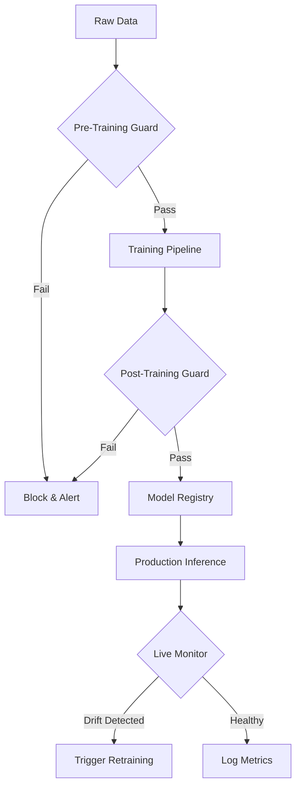

# 🛡️ ML Health Guard: Implementation Plan

## 🎯 Objective
Create a **proactive monitoring system** ("ML Health Guard") for SensorMind that detects **model drift**, **data leakage**, and **training anomalies** *before* they impact production.

---

## 🏗️ Architecture

We will integrate this as a new module `ml.guard` within SensorMind.



---

## 🧩 Key Modules

### 1. Pre-Training Validator (`ml.guard.pre_train`)
**Goal:** Prevent bad data from entering the model.
- **Future Data Leakage Check:**
  - Verify no feature timestamps > target timestamps.
- **Gold Feature Detection:**
  - Check correlation of each feature vs target. If correlation > 0.98, flag as "Suspiciously Predictive" (potential label leakage).
- **Schema Validation:**
  - Ensure data types and ranges match expected schema.

### 2. Post-Training Validator (`ml.guard.post_train`)
**Goal:** ensuring the trained model is realistic.
- **Overfitting Check:**
  - If Training Accuracy > 99.5% AND Test Accuracy < 80% → Overfitting.
- **Too-Good-To-Be-True Check:**
  - If Test Accuracy > 99% → Flag for manual review (likely leakage).
- **Bias Detection:**
  - Check error rates across different segments (e.g., Asset Types).

### 3. Production Monitor (`ml.guard.monitor`)
**Goal:** Detect degradation in live environment.
- **Data Drift (Evidently):**
  - Compare distribution of live features vs. training baseline (PSI, KL Divergence).
- **Prediction Drift:**
  - Are we predicting "Critical Failure" 10x more often than yesterday?
- **Concept Drift:**
  - Monitoring model performance degradation over time.

---

## 🛣️ Roadmap

### Phase 1: The "Leakage Hunter" (Week 1)
- [ ] Create `ml/guard/` directory.
- [ ] Implement `check_time_leakage(df, timestamp_col, target_timestamp_col)`.
- [ ] Implement `check_correlation_leakage(df, target_col, threshold=0.95)`.
- [ ] Integrate into `training_pipeline.py`.

### Phase 2: Post-Training Quality Gates (Week 1-2)
- [ ] Implement `validate_model_metrics(metrics_dict)`.
- [ ] Add "Gatekeeper" step in MLflow: Only register model if validation passes.
- [ ] Alerting: Send Slack msg if model rejected.

### Phase 3: Real-time Drift Monitoring (Week 2-3)
- [ ] Setup `Evidently` Report service.
- [ ] Create `/api/v1/ml/monitor` endpoint.
- [ ] Store drift logs in PostgreSQL `model_health_logs` table.
- [ ] Dashboard: Add "Model Health" tab to SensorMind Admin.

---

## 🛠️ Tech Stack & Integration

- **Library:** `evidently` (for drift), `scipy` (for stats), `pandas`.
- **Storage:** New table `ml_health_events` in Postgres.
- **API:** New router inside `backend/app/api/v1/endpoints/ml_guard.py`.
- **UI:** New "Observability" tab in Next.js dashboard.

## 📝 Example Usage

```python
from ml.guard.validators import LeakageDetector

# In training pipeline
detector = LeakageDetector()
issues = detector.scan(training_data, target_column="failure")

if issues:
    print("❌ Aborting Trigger: Leakage Detected")
    print(issues)
    # Stop training
else:
    model.fit(training_data)
```
